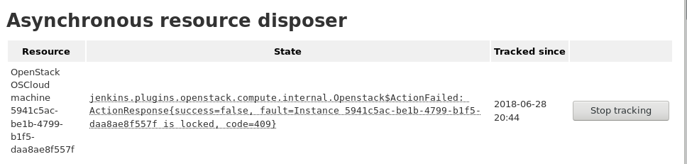

= Resource Disposer Plugin
:toc:
:toc-placement!:
:toc-title:
ifdef::env-github[]
:tip-caption: :bulb:
:note-caption: :information_source:
:important-caption: :heavy_exclamation_mark:
:caution-caption: :fire:
:warning-caption: :warning:
endif::[]

link:https://ci.jenkins.io/job/Plugins/job/resource-disposer-plugin/job/master/[image:https://ci.jenkins.io/job/Plugins/job/resource-disposer-plugin/job/master/badge/icon[Build Status]]
link:https://github.com/jenkinsci/resource-disposer-plugin/graphs/contributors[image:https://img.shields.io/github/contributors/jenkinsci/resource-disposer-plugin.svg[Contributors]]
link:https://plugins.jenkins.io/resource-disposer[image:https://img.shields.io/jenkins/plugin/v/resource-disposer.svg[Jenkins Plugin]]
link:https://github.com/jenkinsci/resource-disposer-plugin/releases/latest[image:https://img.shields.io/github/release/jenkinsci/resource-disposer-plugin.svg?label=changelog[GitHub release]]
link:https://plugins.jenkins.io/resource-disposer[image:https://img.shields.io/jenkins/plugin/i/resource-disposer.svg?color=blue[Jenkins Plugin Installs]]

toc::[]

== Introduction

Resource Disposer is a utility plugin for other plugins to depend on.
Resources that are no longer needed (e.g., VMs to delete, entries in other systems, etc.) are registered with Resource Disposer, which repeatedly attempts to delete them.
Resource disposal failures are reported in an administrative monitor and can be examined at `${JENKINS_URL}/administrativeMonitor/AsyncResourceDisposer/`.
Such entries are persisted between Jenkins restarts and tracked until either the plugin that has contributed them succeeds in disposing of them or they get removed some other way (e.g., the administrator removes them manually).
If the problem preventing the disposal persists, administrators are expected to resolve the problem based on the administrative monitor reports.

== For Developers

To integrate your plugin with Resource Disposer, follow these instructions.

=== Overview

Resource Disposer defines a single point of entry, `AsyncResourceDisposer.get().dispose()`, for consumers to have resources deleted asynchronously.
Resource Disposer tracks the resources and attempts to dispose of them periodically until it succeeds.
The registered resource is represented as a `Disposable`, a named wrapper that knows how the resource should be disposed of through `Disposable#dispose()`.
The method is expected to either confirm the resource has been disposed of (by returning) or to provide the reason the resource could not be disposed of (for mere convenience, by throwing an exception that will be captured as the reason).
The implementation is expected to identify the resource (and its kind/source) as well as the problem that occurred for the administrator to understand.
`Disposable` implementations equal to each other will be collapsed under the assumption that they represent the same resource.

=== Manual intervention

Keep in mind that disposable resources might be disposed of by a human or some other automation.
Therefore, the disposal algorithm must be implemented in such a way as to report successful disposal if the resource is manually disposed of.

=== Serialization

`Disposables` are persisted between Jenkins restarts, so they need to deserialize in such a way as to continue to be able to perform their task.
If the resource is disposed of naturally by restarting Jenkins, the `Disposable` should deserialize into an object that report success all the time and will be unregistered on the first periodic disposal attempt.

== Issues

Report issues and enhancements in the https://issues.jenkins.io/[Jenkins issue tracker].
Use the `resource-disposer-plugin` component in the `JENKINS` project.

== Contributing

Refer to our https://github.com/jenkinsci/.github/blob/master/CONTRIBUTING.md[contribution guidelines].

== License

Licensed under link:LICENSE[the MIT License].
